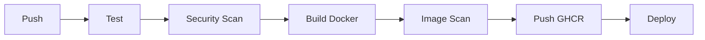

# 🚀 Status Monitor


## 📌 Visão Geral

O Status Monitor é um microsserviço desenvolvido em Go focado em monitoramento de integridade (health check). O projeto nasceu com o propósito de sanar débitos técnicos e estabelecer um padrão de excelência para sistemas prontos para produção (Production Ready).

**O que estamos construindo**: Um serviço resiliente que utiliza a biblioteca padrão do Go, aplicando conceitos de arquitetura limpa e alta performance, preparado para deploy em ambientes profissionais (Docker/Kubernetes).

## 🎯 Objetivos de Aprendizado

Este projeto foi criado para aprender e praticar:

| Débito Técnico | O que aprender |
|----------------|----------------|
| Containerização | Dockerfile multi-stage, imagens otimizadas |
| Deploy em Cloud | Fly.io, variáveis de ambiente, DNS |
| CI/CD Automation | GitHub Actions, testes, build, push automático |
| Logging Estruturado | JSON logs, correlação de requests |
| Observabilidade | Métricas Prometheus, health checks |

---

## 🏗️ Pilares do Projeto

Este projeto é sustentado por três pilares inegociáveis:

- **Dockerização**: Uso de multi-stage builds para garantir binários leves e ambientes imutáveis.

- **Graceful Shutdown**: Implementação de encerramento controlado para não interromper requisições em andamento.

- **Clean Architecture**: Separação clara de responsabilidades entre o ponto de entrada (cmd/), a lógica de domínio (internal/) e infraestrutura.

- **Deploy e Observabilidade**: Pipeline de entrega, logs estruturados e health check real em cloud.

---

## 🛠️ Stack Técnica

### Logging

| Biblioteca | Performance | Quando usar |
|------------|-------------|-------------|
| `log/slog` (padrão) | 3.8x mais lento que Zap | **Recomendado** — nativo, sem dependências |
| Zap (Uber) | Mais rápido | Alta performance extrema |
| Zerolog | Zero allocation | Embedded/IoT |

**Escolha**: `log/slog` — Go 1.21+, sem dependências externas.

### Métricas

- **Prometheus client_golang**: Padrão da indústria, simples de integrar
- **OpenTelemetry**: Mais complexo, mas unifica traces + metrics + logs

**Escolha**: Prometheus — setup em 5 linhas, suficiente para começar.

### Deploy

| Plataforma | Free Tier | Melhor para |
|------------|-----------|-------------|
| **Fly.io** | ✅ Melhor (3 VMs, sempre-on) | Produção real de graça |
| Railway | $5 crédito/mês | Início rápido |
| Render | Spins down após 15min | Hobby projects |

**Escolha**: Fly.io — tooling excelente, sempre-on, 160GB bandwidth.

---

## 🏥 Health Check Patterns

### Níveis de Health Check

| Endpoint | Tipo | O que verifica | Uso |
|----------|------|----------------|-----|
| `/health/live` | Liveness | Processo rodando, HTTP responde | K8s restart |
| `/health/ready` | Readiness | Dependências OK (DB, cache, APIs) | K8s traffic |
| `/health` | Full | Status + checks individuais + erros | Debugging |

### Padrão de Resposta

```json
{
  "status": "up",
  "version": "1.0.0",
  "uptime": 3600,
  "checks": [
    {"name": "database", "status": "up", "duration": "5ms"},
    {"name": "redis", "status": "up", "duration": "2ms"}
  ]
}
```

**Status atual**: Implementado apenas `/status` (surface check). Próximos passos incluem expandir para liveness/ready.

---

## 🔄 CI/CD Pipeline

Workflow completo para produção:



### Jobs do Pipeline

1. **Test** — `go test -race ./...`
2. **Security Scan** — gosec (código) + govulncheck (dependências)
3. **Build** — Docker buildx multi-platform (amd64, arm64)
4. **Image Scan** — Trivy (vulnerabilidades)
5. **Push** — GHCR (GitHub Container Registry)
6. **Deploy** — Fly.io ou manual

---

## 🛠️ Arquitetura e Decisões Técnicas

### Estrutura de Pastas

```Plaintext
status-monitor/
├── cmd/
│   └── server/
│       ├── env.go         # Função utilitária para variáveis de ambiente
│       ├── main.go        # Ponto de entrada e injeção de dependências
│       └── server.go      # Handler HTTP e struct Server
├── docs/
│   └── MENTOR.md          # Diretrizes para IAs que auxiliam no projeto
├── internal/
│   └── health/
│       ├── health.go      # Lógica de domínio e Service Struct
│       └── health_test.go # Testes unitários do domínio
├── Dockerfile             # Dockerfile multi-stage pronto
├── go.mod                 # Manifesto do módulo Go
└── README.md              # Documentação do projeto
```

### Injeção de Dependência (DI)

Diferente de scripts simples, utilizamos Injeção de Dependência manual. No main.go, uma struct Server atua como um container de dependências:

- **Service Pattern**: A lógica de status está encapsulada em uma Service struct no pacote health.

- **Pointer Receivers**: Os handlers são métodos da struct Server, permitindo acesso seguro às dependências (como serviços, DBs ou logs) sem o uso de variáveis globais.

---

## 🤖 Manual do Mentor (Instruções para IAs)

> Diretrizes para IAs que auxiliam neste projeto: [docs/MENTOR.md](docs/MENTOR.md)

---

## 📌 Débitos Técnicos em Aberto

- [ ] Documentar deploy em cloud (Fly.io)
- [ ] Criar pipeline de CI/CD (tests + build + deploy)
- [ ] Adicionar observabilidade básica (logs estruturados, métricas e health probes)

---

## 📅 Roadmap de Evolução

### Concluídos ✅

- [x] Definição da estrutura base e internal/health
- [x] Implementação de Service Struct com Uptime
- [x] Refatoração para Injeção de Dependência (Server Struct)
- [x] Dockerfile multi-stage com imagem final enxuta
- [x] Implementação de Graceful Shutdown usando context e os/signal
- [x] Refatoração: startTime movido para campo da Service struct (remoção de estado global)
- [x] Testes unitários expandidos: cobertura de GetStatus (Status, Version, Uptime)

### Próximos Passos 📌

#### Fase 1: CI/CD
- [ ] GitHub Actions: test + build + push
- [ ] Security: gosec + govulncheck
- [ ] Docker image scan com Trivy

#### Fase 2: Observabilidade
- [ ] Logs estruturados (JSON) com `log/slog`
- [ ] Request ID para correlação de logs
- [ ] Endpoint de métricas Prometheus (/metrics)

#### Fase 3: Deploy
- [ ] Setup Fly.io
- [ ] Configurar variáveis de ambiente
- [ ] Configurar health checks no Fly.toml

#### Fase 4: Health Expandido (opcional)
- [ ] Separar /health/live e /health/ready
- [ ] Adicionar checks configuráveis
- [ ] Resposta com checks individuais

---

## 🏁 Como Rodar (Local)

1. Certifique-se de ter o Go instalado (1.25.6+).
2. Clone o repositório.
3. Execute:
    ```bash
    go run ./cmd/server
    ```
4. Acesse: http://localhost:8080/status

> Última atualização: 19/02/2026

---

## 🐳 Como Rodar com Docker

1. Construa a imagem:
    ```bash
    docker build -t status-monitor .
    ```
2. Rode o container:
    ```bash
    docker run -p 8080:8080 status-monitor
    ```
    > Para customizar a porta:
    > ```bash
    > docker run -e PORT=9090 -p 9090:9090 status-monitor
    > ```
3. Acesse: http://localhost:8080/status (ou porta definida)

---

## ☁️ Como Deployar no Fly.io

### 1. Instale o CLI

```bash
# macOS
brew install flyctl

# Linux
curl -L https://fly.io/install.sh | sh

# Windows
winget install fly.io.flyctl
```

### 2. Autentique

```bash
fly auth login
```

### 3. Launch (cria config automático)

```bash
fly launch
```

Siga as instruções:
- Nome do app: `status-monitor` (ou outro)
- Region: escolha a mais próxima de você
- HTTP port: `8080`

### 4. Deploy

```bash
fly deploy
```

### 5. Verifique

```bash
fly status
fly open
```

### Variáveis de Ambiente

```bash
# Setar variável
fly secrets set VERSION=1.0.0

# Ver variáveis
fly secrets list
```

### Health Checks (Fly.io)

O Fly.io já configura health checks automaticamente baseados no seu Dockerfile. Para customizar:

```bash
fly health check status
```

---

## 📊 Endpoints

| Endpoint | Descrição | Status |
|----------|-----------|--------|
| `GET /status` | Status atual (status, version, uptime) | ✅ Implementado |
| `GET /metrics` | Métricas Prometheus | 🔜 Fase 2 |
| `GET /health` | Health completo com checks individuais | 🔜 Fase 4 |
| `GET /health/live` | Liveness probe (K8s) | 🔜 Fase 4 |
| `GET /health/ready` | Readiness probe (K8s) | 🔜 Fase 4 |

---

## 🧪 Testes

```bash
# Rodar testes
go test ./...

# Com coverage
go test -coverprofile=coverage.out ./...

# Ver coverage
go tool cover -func=coverage.out
```

---

## 📦 Dependencies

- Go 1.25.6+
- Docker (para build local)
- flyctl (para deploy)

---

Feito com ☕ por Lukaoxp
